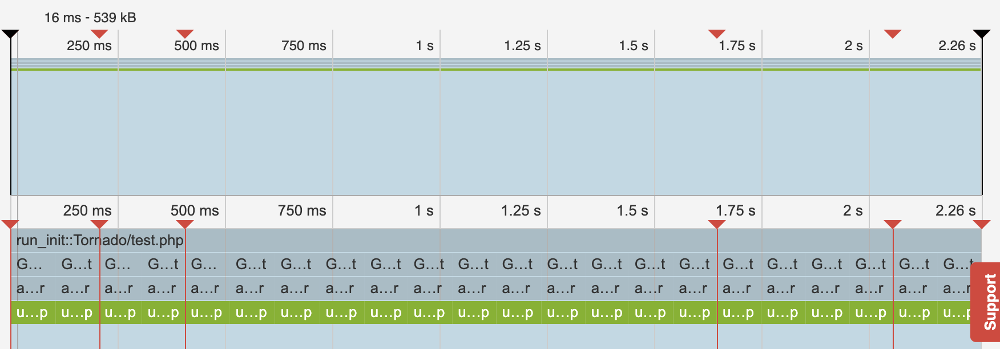

# blackfire-test

Requires [Blackfire extension](https://blackfire.io/).

## Run
```
blackfire run php ./test.php
```

## Output
```
[A] 10 …
[A] 9 …
[B] 5 …
[B] 4 …
[C] 7 …
[C] 6 …
[A] 8 …
[B] 3 …
[C] 5 …
[A] 7 …
[B] 2 …
[C] 4 …
[A] 6 …
[B] 1 …
[C] 3 …
[A] 5 …
[B] 0 !!! Bye
[C] 2 …
[A] 4 …
[C] 1 …
[A] 3 …
[C] 0 !!! Bye
[A] 2 …
[A] 1 …
[A] 0 !!! Bye

Blackfire Run completed
```

## Timeline


[Source code](test.php)
